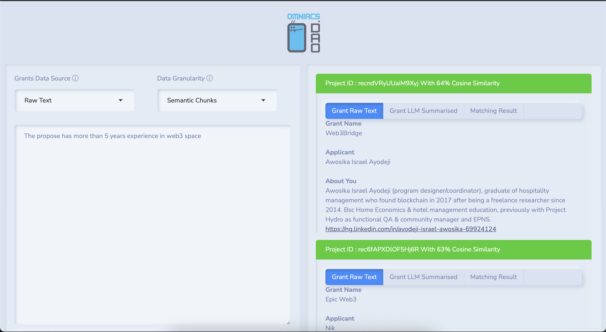
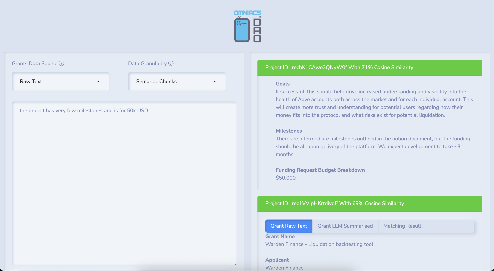

## GrantsMatchingAI

> **AI-powered R Shiny application that helps grant reviewers instantly surface the best-matching grants for any free-form query.**
> It combines R, Python (LangChain + Ollama), Chroma vector store and a slim Shiny UI into a reproducible workflow & Docker image.





---

### Table of Contents

1. [Core idea](#core-idea)
2. [How it works](#how-it-works)
3. [Project layout](#project-layout)
4. [Quick start](#quick-start)
5. [Detailed setup](#detailed-setup)
6. [Configuration knobs](#configuration-knobs)
7. [Running the Shiny app](#running-the-shiny-app)
8. [Docker recipe](#docker-recipe)
9. [Contributing](#contributing)

---

### Core idea

Grant applications are long, noisy and hard to compare. **GrantsMatchingAI** turns each section of every application into dense embeddings, stores them in a local Chroma DB and lets you search (cosine-similarity) with plain language or structured prompts.
You can choose *raw text*, *LLM-summaries* or even *semantic chunks*, then inspect the top-3 hits with side-by-side raw / summarised text and similarity score badges. The UI is 100 % local – no data leaves your machine.

---

### How it works

| Step                                                                                                  | R / Python component                            | Key files                              |
| ----------------------------------------------------------------------------------------------------- | ----------------------------------------------- | -------------------------------------- |
| 1. **Ingest CSV** containing grant records                                                            | `readr::read_csv()`                             | `1_GetData.R` ([GitHub][1])            |
| 2. **Select & rename fields** → `grantsVec.csv`                                                       | tidyverse                                       | `1_GetData.R` ([GitHub][1])            |
| 3. **Create isolated Python venv** with LangChain stack                                               | `reticulate::virtualenv_create()`               | `2_PrepareEnvironment.R` ([GitHub][2]) |
| 4. **LLM summarises** every long-form column                                                          | Ollama Llama-3.1 8B                             | `3_CreateEmbeddings.R` ([GitHub][3])   |
| 5. **Generate embeddings** (Nomic-Embed-Text) for each column, whole grant, semantic chunks, raw text | Chroma vector DB                                | `3_CreateEmbeddings.R` ([GitHub][3])   |
| 6. **Retrieval helpers** build custom similarity scorers                                              | Python → R bridge                               | `helpers.R` ([GitHub][4])              |
| 7. **Shiny UI** drives queries & displays cards                                                       | `ui.R` ([GitHub][5]) / `server.R` ([GitHub][6]) |                                        |
| 8. **Dockerfile** bakes the whole pipeline into one image                                             | rocker/shiny base                               | `Dockerfile` ([GitHub][7])             |

---

### Project layout

```
GrantsMatchingAI/
├─ data/                  # CSVs + persisted Chroma indexes
│   ├─ DataLatest.csv     # raw export of your grants system
│   └─ Embeddings/        # auto-generated vector stores
├─ www/                   # static assets (logo etc.)
├─ 0_Environment.R        # central config (hosts, models)  :contentReference[oaicite:9]{index=9}
├─ 1_GetData.R            # field selection / cleaning
├─ 2_PrepareEnvironment.R # Python venv + package install
├─ 3_CreateEmbeddings.R   # summarise + embed + persist
├─ helpers.R              # retrieval wrappers
├─ ui.R                   # Bootstrap-themed front-end
├─ server.R               # Shiny server logic
└─ Dockerfile             # full build recipe
```

---

### Quick start

```bash
# prerequisites: git, R (≥4.2), Python 3.9+, Ollama running locally
git clone https://github.com/OmniacsDAO/GrantsMatchingAI.git
cd GrantsMatchingAI

# 1) drop / update your own `data/DataLatest.csv` (same columns)
# 2) edit 0_Environment.R if your Ollama host / model names differ
Rscript 1_GetData.R            # clean dataset
Rscript 2_PrepareEnvironment.R # create venv + install deps (~2-3 min)
Rscript 3_CreateEmbeddings.R   # summarise & embed (~few min, depends on #grants)

R -e "shiny::runApp(port = 8180, host = '0.0.0.0')"  # open http://localhost:8180
```

---

### Detailed setup

1. **Ollama servers**

   * `ollamaHostPrepare` – heavy lifting for batch summarisation & embeddings
   * `ollamaHostQuery`   – light, real-time inference for user queries
     Point both to the same host if you only have one instance. Edit [`0_Environment.R`](0_Environment.R). ([GitHub][8])

2. **Models**

   * Embeddings → `nomic-embed-text:v1.5`
   * LLM → `llama3.1:8b-instruct-q6_K`
     Swap any Ollama-compatible models; keep `num_ctx` large enough for your longest section.

3. **Python virtualenv**
   Created automatically under `grantsAI/` and populated with LangChain + Chroma packages. ([GitHub][2])

4. **Data columns expected** (case-sensitive):

   | CSV header (original export)                                                                              | Used for      |
   | --------------------------------------------------------------------------------------------------------- | ------------- |
   | `Record ID`                                                                                               | primary key   |
   | `Project Name`, `Applicant Name`                                                                          | headline      |
   | `About You`, `Project Description`, `Project Goals`, `Milestones`, `Funding Request and Budget Breakdown` | text to embed |

   Modify `1_GetData.R` if your schema differs.

5. **Embedding strategy**

   * Column-level vectors (to answer “show me projects whose **milestones** mention X”).
   * Full-grant vectors (raw & LLM-summarised).
   * Semantic chunks via `SemanticChunker` for fine-grained matching. ([GitHub][3])

---

### Running the Shiny app

| UI control               | What it does                                                                     |
| ------------------------ | -------------------------------------------------------------------------------- |
| **Grants Data Source**   | Choose between raw grant text or LLM-summaries                                   |
| **Data Granularity**     | Whole grant, semantic chunks, or specific sections                               |
| **Query box**            | Natural-language or keyword query                                                |
| **Find Matching Grants** | Retrieves top-3 hits with highest cosine similarity & colour-coded status badges |

Backend retrieval is handled by lightweight Python scorer functions exposed to R. ([GitHub][4])

---

### Docker recipe

A one-liner build produces a fully-self-contained image (R + Python + data + embeddings):

```bash
docker build -t grantsai .
docker run -d --restart unless-stopped -p 4562:8180 grantsai
```

Behind the scenes the Dockerfile:

* Starts from `rocker/shiny` base
* Installs system libs & R packages
* Runs the three R scripts to bake embeddings into the image (so first app load is instant) ([GitHub][7])
* Launches Shiny on port 8180.

You can mount an external `data/` volume if you plan to refresh CSVs frequently:

```bash
docker run -d -p 4562:8180 \
  -v /path/to/newdata:/app/grantsAI/data \
  grantsai
```

---

### Configuration knobs

| File              | Purpose                                              |
| ----------------- | ---------------------------------------------------- |
| `0_Environment.R` | Ollama hosts, model names, context window sizes      |
| `helpers.R`       | Retrieval top-K (default = 100) and scoring function |
| `ui.R`            | Theme (`bs_theme()`), logo, footer CTA               |
| `Dockerfile`      | Base image & exposed port                            |

---

### Contributing

PRs are welcome! Feel free to open issues for:

* additional grant-source connectors
* new embedding models
* UI/UX tweaks

Please keep code style tidy and include reproducible examples.

---

> 💚 **Support digital public goods** – grab some **\$IACS** tokens (Base) and help us build more open-source tooling for grantmakers!   Contract: `0x46e69Fa9059C3D5F8933CA5E993158568DC80EBf`

---

Happy matching!